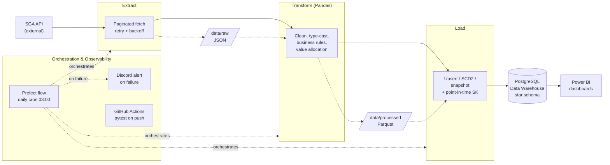
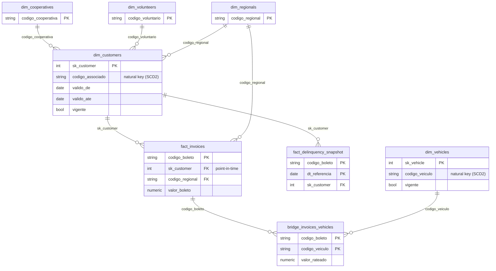

# Data Engineering Project - SGA API Pipeline

This repository contains the implementation of a data pipeline (SGA API Pipeline) designed to extract, transform, and load data efficiently, ensuring data consistency and reliability for downstream analysis and reporting.

The pipeline architecture is built using modular Python scripts and industry-standard practices for clean, scalable data engineering.

Access structured and cleaned data ready for consumption. 💪

---

## Architecture Overview



---

## Table of Contents

- [Architecture Overview](#architecture-overview)
- [Architecture & Folder Structure](#architecture--folder-structure)
- [How It Works](#how-it-works)
  - [Data Extraction](#data-extraction)
  - [Data Transformation](#data-transformation)
  - [Data Load](#data-load)
  - [Data Model & Analytical Views](#data-model--analytical-views)
  - [Infrastructure & Orchestration](#infrastructure--orchestration)
- [Entities](#entities)
- [Testing & CI](#testing--ci)
- [Prerequisites](#prerequisites)
- [Running Project](#running-project)
- [Running with Docker](#running-with-docker)
- [Scheduling](#scheduling)
- [License](#license)
- [Contact](#contact)

---

## Architecture & Folder Structure

The project follows a rigorous separation of concerns to ensure maintainability:

```
sga-api-pipeline/
├── .github/workflows/  # Continuous integration (pytest on push/PR)
├── data/
│   ├── raw/            # Raw JSON files extracted from the API
│   └── processed/      # Cleaned Parquet files ready for loading
├── extract/            # Extraction scripts (API connectors)
├── infra/              # Connections, config, logging, retry, alerts
├── load/               # Loading modules (PostgreSQL insertions)
├── logs/               # Application and pipeline execution logs
├── orchestrators/      # Prefect flow and scheduling scripts
├── sql/                # Hand-written analytical views
├── tests/              # Unit tests (pytest)
├── transform/          # Data cleaning, processing, and business logic (Pandas)
├── Dockerfile          # Pipeline application image
└── docker-compose.yml  # Full stack: pipeline + PostgreSQL
```

---

## How It Works

### Data Extraction

The modules inside the `/extract` folder are responsible for connecting to the SGA API. They fetch data in paginated batches across all available statuses, ensuring connection security through environment variables (`.env`). Raw data is saved as JSON files in `data/raw/`.

Invoices use a multi-window incremental strategy (by emission, payment, and due date) to capture new and recently changed records. Delinquency uses a full-history extract — querying only `status=2` (open) with no date filter — to ensure no overdue invoice is missed regardless of when it was issued.

Transient server errors (HTTP 5xx, timeouts, dropped connections) are retried with exponential backoff via the shared `infra/retry.py` decorator; genuine client errors (4xx) fail fast without retrying.

### Data Transformation

Inside the `/transform` folder, data undergoes rigorous cleaning and structuring:

- Data type casting and formatting.
- Handling missing values and duplicates.
- Serialization of nested fields (arrays and dictionaries) into flat, relational columns.
- Business rules (aging, payment reconciliation, age) for invoices, delinquency and customers.
- Value allocation: an invoice covering multiple vehicles is exploded into one row per vehicle, splitting `valor_boleto` evenly so `SUM(valor_rateado)` always reconstructs the original invoice value. This feeds the invoice-vehicle bridge.

Cleaned data is saved as Parquet files in `data/processed/`.

### Data Load

The `/load` folder safely writes processed data into PostgreSQL using the following strategies:

| Strategy | Tables | Behavior |
|---|---|---|
| Upsert | `dim_cooperatives`, `dim_regionals`, `dim_volunteers`, `fact_invoices`, `bridge_invoices_vehicles` | Inserts new records; updates existing ones by natural (or composite) key |
| SCD Type 2 | `dim_customers`, `dim_vehicles` | Tracks attribute history in place via `vigente`/`valido_de`/`valido_ate`: changes to monitored columns close the current version and open a new one; other attribute changes are refreshed without versioning |
| Daily snapshot replace | `fact_delinquency_snapshot` | Deletes and reinserts that day's slice of open invoices; re-runs on the same day are idempotent |

Cross-cutting load guarantees:

- **Schema reconciliation:** before every upsert or SCD2 load, the destination table's schema is reconciled against the incoming DataFrame — missing columns are added automatically (`ALTER TABLE ... ADD COLUMN`), so new business-rule columns introduced upstream never fail with `UndefinedColumn`.
- **Explicit typing:** each temp table is created with an explicit SQLAlchemy type map, so a column never silently lands as the wrong type (e.g. a date arriving as `TEXT`, or a nullable surrogate key drifting to `DOUBLE PRECISION`).
- **Partial-extraction guard:** if an incoming dimension's row count drops more than 30% versus what is already loaded, the load is refused for that entity instead of silently shrinking the dimension.
- **Audit metadata:** rows are stamped with `criado_em`, `atualizado_em` and (where applicable) `data_referencia`. `criado_em` is immutable — excluded from the `ON CONFLICT` update — so reruns never overwrite a row's original creation timestamp.
- **Composite & immutable keys:** `upsert_to_postgres` accepts a composite primary key (e.g. the bridge's `codigo_boleto` + `codigo_veiculo`) and a list of immutable columns to freeze on conflict.

### Data Model & Analytical Views



The model is a star schema with proper surrogate keys, foreign keys and indexes:

- **Surrogate keys:** SCD2 dimensions carry a serial surrogate key (`sk_customer`, `sk_vehicle`). Because a natural key repeats across historical versions, a surrogate key is what fact tables reference to point at a *specific* version.
- **Point-in-time attribution:** facts resolve `sk_customer` against the `dim_customers` version that was effective on the fact's own date (`data_emissao`), not the current version — so historical analysis reflects who the customer *was* at the time.
- **Invoice-vehicle bridge:** `bridge_invoices_vehicles` resolves the many-to-many between invoices and vehicles (an invoice can bill several vehicles), carrying `qtd_veiculos_boleto` and the pro-rated `valor_rateado`.
- **Foreign keys & indexes:** FK constraints link facts and dimensions to their referenced dimensions; join columns are indexed for BI query performance. Orphan natural keys (codes deleted upstream but still referenced historically) are handled with explicit "unknown member" placeholder rows so no fact is left unlinked.

Hand-written views in `sql/views/` support delinquency-by-vehicle analysis:

| View | Attribution | Use case |
|---|---|---|
| `vw_delinquency_by_vehicle_atual` | Vehicle's **current** owner (`dim_vehicles_current`) | "Who do I contact today about this delinquency?" — operational |
| `vw_delinquency_by_vehicle_historico` | Vehicle's owner **on the snapshot date** (SCD2 point-in-time) | Historical performance by volunteer, preserving attribution even if the vehicle later changed hands |

### Infrastructure & Orchestration

**Infrastructure (`/infra`):** Manages the database connection pool (a single cached engine with `pool_pre_ping`), API authentication, environment configuration, structured logging (one log file per day), a reusable retry decorator, and failure alerting.

**Orchestration (`/orchestrators`):** The full ETL flow (Extract → Transform → Load) is a Prefect flow (`run_pipeline`). On failure, an `on_failure` hook posts a formatted message to a Discord webhook — timestamps converted to America/Sao_Paulo, maintainer mentioned to trigger a mobile push — so unattended runs never fail silently.

---

## Entities

| Entity | Table | Notes |
|---|---|---|
| Volunteers | `dim_volunteers` | Upsert by natural key |
| Cooperatives | `dim_cooperatives` | Upsert by natural key |
| Regionals | `dim_regionals` | Upsert by natural key |
| Customers | `dim_customers` | SCD Type 2; surrogate key `sk_customer` |
| Vehicles | `dim_vehicles` | SCD Type 2; surrogate key `sk_vehicle` |
| Invoices | `fact_invoices` | Incremental upsert; point-in-time `sk_customer`; multi-window extraction |
| Invoice–Vehicle | `bridge_invoices_vehicles` | Bridge resolving the invoice↔vehicle many-to-many, with pro-rated value |
| Delinquency | `fact_delinquency_snapshot` | Daily snapshot of all open invoices (`status=2`) |

---

## Testing & CI

Unit tests live in `/tests` and run with `pytest`. They cover the transformation helpers, business rules, the retry decorator, the API fetcher, the dimension-drop guard, and the SCD2 surrogate-key behavior — all mocked, with no dependency on a live API or database.

A GitHub Actions workflow (`.github/workflows/tests.yml`) runs the full test suite on every push and pull request to `main`.

---

## Prerequisites

Software required to run the project locally:

- Python 3.10+
- PostgreSQL
- Essential packages listed in `requirements.txt`
- Environment file configured (`.env`)

Alternatively, run everything with Docker (see [Running with Docker](#running-with-docker)) — only Docker, Docker Compose and a configured `.env` are required, with no local Python or PostgreSQL install.

---

## Running Project

Clone the repository:

```bash
git clone https://github.com/AntonioAugustof/sga-api-pipeline.git
cd sga-api-pipeline
```

Install dependencies:

```bash
pip install -r requirements.txt
```

Configure your environment variables — create a `.env` file in the root directory:

```env
API_BASE_URL=https://your-api-url.com
API_KEY=your_api_key
SYSTEM_USER=your_system_user
SYSTEM_PASSWORD=your_system_password
DB_HOST=localhost
DB_PORT=5432
DB_NAME=your_database
DB_USER=your_user
DB_PASSWORD=your_password
# Optional: Discord webhook for failure alerts (skipped if unset)
DISCORD_WEBHOOK_URL=
```

Run the full pipeline:

```bash
python -m orchestrators.run_pipeline
```

Or run individual stages:

```bash
python -m extract.extract_volunteers
python -m transform.transform_volunteers
python -m load.load_dimensions
```

Run the tests:

```bash
pytest
```

---

## Running with Docker

The project ships with a `Dockerfile` and a `docker-compose.yml` that bring up the whole stack — the pipeline and its PostgreSQL database — reproducibly, with no local Python or PostgreSQL install required.

Prerequisites: Docker and Docker Compose, plus a configured `.env` (same variables as above).

Build and start the stack in the background:

```bash
docker compose up --build -d
```

This starts two services: `postgres` (PostgreSQL 18, on host port `5433` to avoid clashing with a local install on `5432`, data persisted in a named volume) and `pipeline` (the app, serving the Prefect schedule). Inside the compose network the app reaches the database at host `postgres` — Compose overrides `DB_HOST` accordingly, so the `.env` value is only used for non-Docker runs.

Useful commands:

```bash
docker compose ps                    # service status
docker compose logs -f pipeline      # follow the pipeline logs
docker compose down                  # stop the stack (keeps the database volume)
docker compose down -v               # stop and delete the database volume
```

The containerized database starts empty and is repopulated by the pipeline on its next run. To seed it with an existing database instead, restore a dump into the `postgres` service:

```bash
docker compose exec -T postgres psql -U "$DB_USER" -d "$DB_NAME" < your_dump.sql
```

---

## Scheduling

The pipeline runs unattended as a daily Prefect flow. `orchestrators/serve.py` registers a cron schedule (03:00, `America/Sao_Paulo`) and serves the deployment:

```bash
python -m orchestrators.serve
```

This process must stay alive to fire the schedule. In production it runs as a Windows service (via NSSM), so it survives reboots and no terminal needs to stay open. Optionally, `prefect server start` exposes a local UI at `http://localhost:4200` for run history and monitoring.

---

## License

Distributed under the MIT License. See `LICENSE` for more information.

---

## Contact

Please feel free to contact me if you have any questions.

Antonio Augusto - @AntonioAugustoF
