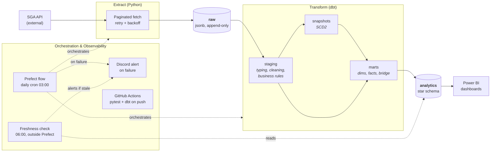
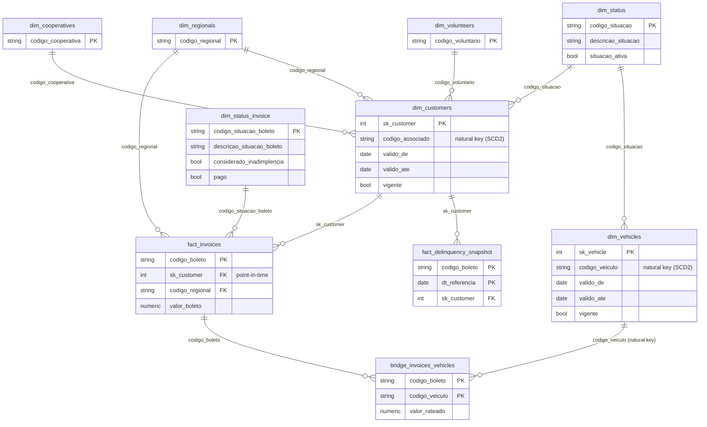

# Data Engineering Project - SGA API Pipeline

[](https://github.com/AntonioAugustof/sga-api-pipeline/actions/workflows/tests.yml)


This repository contains the implementation of an ELT data pipeline (SGA API Pipeline): Python lands the SGA API in PostgreSQL, dbt builds the warehouse from what landed, and Power BI reads the result. Every transformation is versioned SQL, and every guarantee the warehouse depends on is a test that runs against real rows every night.

The pipeline architecture is built using modular Python scripts and industry-standard practices for clean, scalable data engineering.

Access structured and cleaned data ready for consumption. 💪

---

## Architecture Overview

This is an **ELT** pipeline: Python only extracts, and every transformation is
SQL that runs inside the warehouse. It was an ETL pipeline until the cutover in
[`ROADMAP.md`](ROADMAP.md); the diagrams in [`static/`](static/) record how it
got here and why.


```mermaid
flowchart LR
    API["SGA API<br/>(external)"]

    subgraph Extract["Extract (Python)"]
        EX["Paginated fetch<br/>retry + backoff"]
    end

    RAW[("<b>raw</b><br/>jsonb, append-only")]

    subgraph DBT["Transform (dbt)"]
        STG["staging<br/><i>typing, cleaning,<br/>business rules</i>"]
        SNAP["snapshots<br/><i>SCD2</i>"]
        MART["marts<br/><i>dims, facts, bridge</i>"]
        STG --> SNAP --> MART
        STG --> MART
    end

    ANA[("<b>analytics</b><br/>star schema")]
    BI["Power BI<br/>dashboards"]

    API --> EX --> RAW --> STG
    MART --> ANA --> BI

    subgraph Ops["Orchestration & Observability"]
        PF["Prefect flow<br/>daily cron 03:00"]
        AL["Discord alert<br/>on failure"]
        FR["Freshness check<br/>06:00, outside Prefect"]
        CI["GitHub Actions<br/>pytest + dbt on push"]
    end

    PF -. orchestrates .-> Extract
    PF -. orchestrates .-> DBT
    PF -. on failure .-> AL
    FR -. reads .-> ANA
    FR -. alerts if stale .-> AL
```

The raw layer is append-only and never rewritten, so every model can be rebuilt
from what the API actually returned. What *cannot* be rebuilt is the history the
warehouse accumulated — the API answers about the present, and yesterday's
answer is gone unless it was stored. That is why the facts and the SCD2
snapshots are incremental rather than recreated, and why the backup matters.

---

## Table of Contents

- [Architecture Overview](#architecture-overview)
- [Architecture & Folder Structure](#architecture--folder-structure)
- [How It Works](#how-it-works)
  - [Data Extraction](#data-extraction)
  - [Transformation and Load with dbt](#transformation-and-load-with-dbt)
  - [Data Model & Analytical Views](#data-model--analytical-views)
  - [Infrastructure & Orchestration](#infrastructure--orchestration)
- [Entities](#entities)
- [Testing & CI](#testing--ci)
  - [Analytics Layer with dbt](#analytics-layer-with-dbt)
- [Prerequisites](#prerequisites)
- [Running Project](#running-project)
- [Local PostgreSQL with Docker](#local-postgresql-with-docker)
- [Scheduling](#scheduling)
- [License](#license)
- [Contact](#contact)

---

## Architecture & Folder Structure

The project follows a rigorous separation of concerns to ensure maintainability:

```
sga-api-pipeline/
├── .github/workflows/  # Continuous integration (pytest + dbt on push/PR)
├── dbt/                # The whole warehouse: models, snapshots, tests, macros
├── extract/            # Extraction scripts (API connectors) — the only Python that touches data
├── infra/              # Connections, config, logging, retry, alerts, raw writer,
│                       # dbt runner, freshness check
├── logs/               # Application and pipeline execution logs
├── orchestrators/      # Prefect flow and scheduling scripts
├── scripts/            # Verified warehouse backup, outside the daily flow
├── sql/                # DDL for the raw schema (ddl/) and one-off migrations
├── static/             # Architecture diagrams
├── tests/              # Unit tests (pytest)
├── Dockerfile          # Pipeline application image
└── docker-compose.yml  # Disposable PostgreSQL for local development
```

---

## How It Works

### Data Extraction

The modules inside the `/extract` folder are responsible for connecting to the SGA API. They fetch data in paginated batches across all available statuses, ensuring connection security through environment variables (`.env`). Each batch is written to the `raw` schema as `jsonb`, append-only, with one `_extracted_at` timestamp shared by the whole batch and the endpoint it came from — so a model can always be traced back to the exact response that produced it.

This is the only Python that touches business data, and it is deliberately dumb: it does not interpret, reshape or filter anything. A batch that does not land in full is refused rather than persisted, because `raw` is now the only source every model is built from.

Invoices use a multi-window incremental strategy (by emission, payment, and due date) to capture new and recently changed records. Delinquency uses a full-history extract — querying only `status=2` (open) with no date filter — to ensure no overdue invoice is missed regardless of when it was issued.

Transient server errors (HTTP 5xx, timeouts, dropped connections) are retried with exponential backoff via the shared `infra/retry.py` decorator; genuine client errors (4xx) fail fast without retrying.

### Transformation and Load with dbt

Everything between `raw` and the star schema is SQL under `dbt/`, in three layers.

| Layer | Materialised as | What it does |
|---|---|---|
| `staging` | view | One model per entity: casts types, trims (including U+00A0), and applies the business rules — aging, payment reconciliation, age |
| `snapshots` | snapshot | SCD Type 2 for customers and vehicles. dbt closes the old version and opens the new one in a single `MERGE` |
| `marts` | table / incremental | The dimensions, the facts, the invoice-vehicle bridge and the delinquency marts |

Two choices in that table carry most of the design:

**The facts are incremental, not rebuilt.** Extraction fetches what is new, paid
or rescheduled — never the full history. `raw` holds a week of invoices against
more than 300,000 in the fact. A `table` materialisation would have dropped 98%
of the revenue history with every test still passing, which is exactly the kind
of silent success this project is built to prevent. The same applies to the
bridge and to the daily delinquency snapshots: a photograph of a past day cannot
be retaken.

**The SCD2 lives in `dbt snapshot`, not in hand-written SQL.** The previous
implementation closed a version and opened its replacement in two statements,
and a failure between them stranded 1,289 vehicles with no current version at
all — R$ 11M of attribution resolving to nothing. A snapshot does both in one
`MERGE`, which makes that failure unrepresentable rather than merely fixed;
`assert_one_open_version_per_snapshot_key` exists to prove the claim instead of
assuming it.

Value allocation still happens, now in `bridge_invoices_vehicles`: an invoice
covering several vehicles becomes one row per vehicle with `valor_boleto` split
across them, and `assert_rateio_reconstructs_invoice_value` holds
`SUM(valor_rateado)` to the original invoice value.

Every table carries `criado_em`, and the facts also carry `data_referencia`
taken from the data rather than from the run date. `criado_em` sits in
`merge_exclude_columns` on the incremental models, so a row keeps the moment it
first appeared no matter how many times it is merged afterwards.

### Data Model & Analytical Views


```mermaid
erDiagram
    dim_customers ||--o{ fact_invoices : "sk_customer"
    dim_customers ||--o{ fact_delinquency_snapshot : "sk_customer"
    dim_regionals ||--o{ fact_invoices : "codigo_regional"
    dim_cooperatives ||--o{ dim_customers : "codigo_cooperativa"
    dim_volunteers ||--o{ dim_customers : "codigo_voluntario"
    dim_regionals ||--o{ dim_customers : "codigo_regional"
    fact_invoices ||--o{ bridge_invoices_vehicles : "codigo_boleto"
    dim_vehicles ||--o{ bridge_invoices_vehicles : "codigo_veiculo (natural key)"
    dim_status ||--o{ dim_customers : "codigo_situacao"
    dim_status ||--o{ dim_vehicles : "codigo_situacao"
    dim_status_invoice ||--o{ fact_invoices : "codigo_situacao_boleto"

    dim_customers {
        int sk_customer PK
        string codigo_associado "natural key (SCD2)"
        date valido_de
        date valido_ate
        bool vigente
    }
    dim_vehicles {
        int sk_vehicle PK
        string codigo_veiculo "natural key (SCD2)"
        date valido_de
        date valido_ate
        bool vigente
    }
    dim_status {
        string codigo_situacao PK
        string descricao_situacao
        bool situacao_ativa
    }
    dim_status_invoice {
        string codigo_situacao_boleto PK
        string descricao_situacao_boleto
        bool considerado_inadimplencia
        bool pago
    }
    dim_cooperatives {
        string codigo_cooperativa PK
    }
    dim_regionals {
        string codigo_regional PK
    }
    dim_volunteers {
        string codigo_voluntario PK
    }
    fact_invoices {
        string codigo_boleto PK
        int sk_customer FK "point-in-time"
        string codigo_regional FK
        numeric valor_boleto
    }
    fact_delinquency_snapshot {
        string codigo_boleto PK
        date dt_referencia PK
        int sk_customer FK
    }
    bridge_invoices_vehicles {
        string codigo_boleto PK
        string codigo_veiculo PK
        numeric valor_rateado
    }
```

The model is a star schema with surrogate keys on the SCD2 dimensions:

- **Surrogate keys:** `dim_customers` and `dim_vehicles` are SCD2 and carry a serial surrogate key (`sk_customer`, `sk_vehicle`). A natural key repeats across historical versions, so only the surrogate key identifies a *specific* version.
- **Point-in-time attribution:** `fact_invoices` and `fact_delinquency_snapshot` resolve `sk_customer` against the `dim_customers` version effective on the fact's own date, not the current version — so historical analysis reflects who the customer *was* at the time.
- **Invoice-vehicle bridge:** `bridge_invoices_vehicles` resolves the many-to-many between invoices and vehicles (an invoice can bill several vehicles), carrying `qtd_veiculos_boleto` and the pro-rated `valor_rateado`. It relates to `dim_vehicles` by the **natural key**, not by `sk_vehicle` — see *Known limitations* below.
- **Reference dimensions:** `dim_status` and `dim_status_invoice` mirror the source's status lists. They are SCD1 and keyed by the natural code — small, stable reference data where a surrogate key would add a join without buying anything. `dim_status_invoice` also records `considerado_inadimplencia` and `pago`, business rules that otherwise live only in the source API.
- **Foreign keys & indexes:** FK constraints link `fact_invoices` and `fact_delinquency_snapshot` to `dim_customers` (via `sk_customer`) and to `dim_regionals`, and link the SCD2 dimensions to `dim_volunteers`, `dim_regionals` and `dim_cooperatives`. Fact join columns (`sk_customer`, `codigo_associado`, `codigo_regional`) are indexed for BI query performance.

Hand-written views in `sql/views/` support delinquency-by-vehicle analysis:

| View | Attribution | Use case |
|---|---|---|
| `vw_delinquency_by_vehicle_atual` | Vehicle's **current** owner (`dim_vehicles_current`) | "Who do I contact today about this delinquency?" — operational |
| `vw_delinquency_by_vehicle_historico` | Vehicle's owner **on the snapshot date** (SCD2 point-in-time) | Historical performance by volunteer, preserving attribution even if the vehicle later changed hands |

`vw_delinquency_by_vehicle_historico` resolves the vehicle version with a half-open interval
(`dt_referencia >= valido_de AND (valido_ate IS NULL OR dt_referencia < valido_ate)`), so exactly one
version matches even on the day a version is closed and the next one opens.

#### Known limitations

Documented rather than glossed over, since they shape how the model should be queried:

- **The bridge relates to `dim_vehicles` by natural key, not by `sk_vehicle`.** `codigo_veiculo` repeats
  across SCD2 versions, so joining the bridge straight to `dim_vehicles` fans out and double-counts
  `valor_rateado`. Consumers must join through `dim_vehicles_current` (one row per vehicle) — which is
  what the BI model does. The proper fix is to carry `sk_vehicle` on the bridge, resolved point-in-time.
- **Revenue is attributed to the vehicle's *current* volunteer**, a consequence of the item above.
  That is fine for portfolio management, but not for commission: moving a vehicle between volunteers
  rewrites past rankings. Delinquency is unaffected — it has the historical view above.
- **No "unknown member" rows.** Natural keys deleted upstream but still referenced by facts simply fail
  to match, and the affected rows drop out of dimension-sliced analysis instead of landing in an
  explicit bucket.
- **`bridge_invoices_vehicles` has no FK to `dim_vehicles` and no index on `codigo_veiculo`.** A FK here
  would surface missing vehicles as a load error rather than as silently unattributed revenue.

### Infrastructure & Orchestration

**Infrastructure (`/infra`):** Manages the database connection pool (a single cached engine with `pool_pre_ping`), API authentication, environment configuration, structured logging (one log file per day), a reusable retry decorator, and failure alerting.

**Orchestration (`/orchestrators`):** The flow is `extract → dbt build`, run daily by Prefect. dbt runs *inside* the flow on purpose: while it ran on demand, three days of drift collapsed fifty-nine SCD2 transitions into a single date, and a warehouse written last night compared against one written last week measures the schedule rather than the models. A failing dbt node — a test included — stops the flow rather than letting it report success.

On failure, an `on_failure` hook posts a formatted message to a Discord webhook — timestamps converted to America/Sao_Paulo, maintainer mentioned to trigger a mobile push — so unattended runs never fail silently. What that hook cannot cover is the flow never starting, which is why `infra/freshness.py` runs from the Windows Task Scheduler instead: an orchestrator cannot be the watchdog for its own death.

---

## Entities

| Entity | Table | Notes |
|---|---|---|
| Volunteers | `dim_volunteers` | Upsert by natural key |
| Cooperatives | `dim_cooperatives` | Upsert by natural key |
| Regionals | `dim_regionals` | Upsert by natural key |
| Customers | `dim_customers` | SCD Type 2; surrogate key `sk_customer` |
| Vehicles | `dim_vehicles` | SCD Type 2; surrogate key `sk_vehicle` (currently consumed only by `vw_delinquency_by_vehicle_historico`) |
| Statuses | `dim_status` | Reference dimension (SCD1) for customer/vehicle statuses |
| Invoice statuses | `dim_status_invoice` | Reference dimension (SCD1); carries `considerado_inadimplencia` and `pago` |
| Invoices | `fact_invoices` | Incremental upsert; point-in-time `sk_customer`; multi-window extraction |
| Invoice–Vehicle | `bridge_invoices_vehicles` | Bridge resolving the invoice↔vehicle many-to-many, with pro-rated value |
| Delinquency | `fact_delinquency_snapshot` | Daily snapshot of all open invoices (`status=2`) |

---

## Testing & CI

Unit tests live in `/tests` and run with `pytest`. They cover what is left of the Python: the retry decorator, the API fetcher, the raw writer and its entity allowlist, the extraction guard, the alerting, the logger and the freshness thresholds — all mocked, with no dependency on a live API or database.

The suite shrank from 137 tests to 41 at the cutover. Nothing was weakened: the removed tests covered removed code, and the guarantees they held are now expressed as dbt tests that run against real rows every night, which is where they belong.

A GitHub Actions workflow (`.github/workflows/tests.yml`) runs two jobs on every push and pull request to `main`: `pytest` with `ruff`, and a `dbt` job that stands up a throwaway PostgreSQL container, applies the raw DDL, and runs `dbt build --empty` so every model and test reaches a real database with `limit 0`.

---

## Analytics Layer with dbt

The `pytest` suite verifies Python functions. It cannot catch a build that
finishes cleanly and holds wrong data — which is what every incident in this
project has been. That is the job of the tests inside `dbt/`, which run against
real rows on every nightly build and fail the flow when they do not pass.

- **Schema tests** (`dbt/models/**/*.yml`) — surrogate keys are unique and not
  null, natural keys are never null.
- **Singular tests** (`dbt/tests/`) — one open version per SCD2 key, no billed
  vehicle missing from the dimension, `SUM(valor_rateado)` reconstructing
  `valor_boleto`, the point-in-time mart not fanning out, and the customers
  whose typed-in birth dates are impossible.

Three of them warn rather than fail, and each threshold records a known debt at
its exact size: one orphan vehicle, two inferred cooperatives, thirty impossible
dates. They stay visible on every run and break the build the moment the debt
grows.

Twenty-two further tests existed during the migration to compare every row
against the pandas path. They did their job — they are what surfaced the
accumulating facts, the leaked Python `repr` in `campos_opcionais`, the
non-breaking spaces in 245 invoice descriptions and the two-extractions-in-one-day
divergence — and they were removed with the schema they compared against.

### Models

`dbt build` creates the whole `analytics` schema: nine staging views, two
snapshots, two intermediate views and eleven marts.

The marts Power BI reads:

- `dim_customers`, `dim_vehicles` — SCD Type 2, one row per version, with
  `valido_de` / `valido_ate` / `vigente` derived from the snapshot.
- `dim_regionals`, `dim_cooperatives`, `dim_volunteers`, `dim_status`,
  `dim_status_invoice` — simple dimensions.
- `fact_invoices`, `bridge_invoices_vehicles`, `fact_delinquency_snapshot`.
- `mart_delinquency_current` — delinquency attributed to whoever is responsible
  for the vehicle **today**.
- `mart_delinquency_point_in_time` — attributed to whoever was responsible on
  the snapshot's reference date.

The two delinquency marts replace the `vw_delinquency_by_vehicle_atual` and
`_historico` views, which lived only inside the database — unversioned,
untested, and invisible to lineage.

`sk_vehicle` and `sk_customer` are deterministic hashes rather than serials, so
a rebuilt warehouse produces the same keys. Downstream tools should relate on
them and not on the natural key, which repeats across SCD2 versions and fans
out.

Two rules the models must not break:

- **Never `--full-refresh`** an incremental model against the real warehouse. It
  discards accumulated history the API cannot return again.
- **Never `dbt build --empty`** against it either. dbt bakes the `limit 0` into
  the relations themselves, so every view and table is left empty until a normal
  build recreates them. It is safe only against the throwaway container in CI.

### Running

The daily run needs no command — `infra/dbt_runner.py` invokes dbt from inside
the Prefect flow and raises on any failing node.

To run it by hand, note that dbt does not load `.env` itself: `profiles.yml`
reads the credentials through `env_var`, so export them first.

```bash
set -a; source .env; set +a
cd dbt && dbt build
```

Or from the repository root:

```bash
dbt build --project-dir dbt --profiles-dir dbt
```

Running it manually on a day the schedule already fired means two extractions
in one day, and the warehouse will record the second observation as a new SCD2
version. That is correct behaviour, but it is worth knowing before it surprises
you.

### THe known-orphan threshold

`assert_no_orphan_vehicles_in_bridge` is configured with `error_if: '>1'`.
One vehicle (`3738`) is billed by an invoice but has no current row in
`dim_vehicles`. It predates the fix to the source status list and cannot be
resolved from the API today.

The threshold records that debt at its exact size: it warns on every run so the
gap stays visible, and it fails the moment a second orphan appears. Deleting the
test would hide a real problem; leaving it permanently red would train everyone
to ignore it.

---

## Prerequisites

Software required to run the project locally:

- Python 3.10+
- PostgreSQL
- Essential packages listed in `requirements.txt`
- Environment file configured (`.env`)

A disposable PostgreSQL for development is available via Docker Compose (see [Local PostgreSQL with Docker](#local-postgresql-with-docker)); the pipeline itself always runs on the host.

---

## Running Project

Clone the repository:

```bash
git clone https://github.com/AntonioAugustof/sga-api-pipeline.git
cd sga-api-pipeline
```

Install dependencies:

```bash
pip install -r requirements.txt
```

Configure your environment variables — create a `.env` file in the root directory:

```env
API_BASE_URL=https://your-api-url.com
API_KEY=your_api_key
SYSTEM_USER=your_system_user
SYSTEM_PASSWORD=your_system_password
DB_HOST=localhost
DB_PORT=5432
DB_NAME=your_database
DB_USER=your_user
DB_PASSWORD=your_password
# Optional: Discord webhook for failure alerts (skipped if unset)
DISCORD_WEBHOOK_URL=
# Optional: Discord user id mentioned on failure (alert is sent without a
# mention if unset)
DISCORD_ALERT_USER_ID=
```

Run the full pipeline:

```bash
python -m orchestrators.run_pipeline
```

Or run individual stages:

```bash
python -m extract.extract_volunteers   # lands one entity in raw
python -m infra.freshness              # the staleness check, on demand
python -m scripts.backup_warehouse     # dump + verified restore
```

Modules must be run with `python -m` **from the repository root**: imports are absolute (`from infra.config import config`), so running a file by path (`python extract/extract_volunteers.py`) puts only that file's folder on `sys.path` and fails with `ModuleNotFoundError: No module named 'infra'`.

Run the tests:

```bash
pytest
```

---

## Local PostgreSQL with Docker

The warehouse itself runs on a native PostgreSQL service, and the pipeline is
scheduled by two Windows services — see [Scheduling](#scheduling). The compose
stack is not that deployment: it only brings up a disposable PostgreSQL for
local development and tests, published on host port `5433` so it never shadows
the real database on `5432`.

```bash
docker compose up -d              # start the throwaway database
docker compose ps                 # service status
docker compose down               # stop it (keeps the volume)
docker compose down -v            # stop and delete the volume
```

To point a run at it, override `DB_PORT=5433`. Do this deliberately: a stale
copy on `5433` looks exactly like the real warehouse until you count the tables.

To rebuild the schema in an empty instance, apply the raw DDL and let dbt
create the rest:

```bash
docker compose exec -T postgres psql -U "$DB_USER" -d "$DB_NAME" < sql/ddl/010_raw_schema.sql
cd dbt && dbt build
```

Only `raw` is versioned as DDL, because it is the only schema this project
creates by hand. Everything in `analytics` is created by dbt from the models,
so there is no second description of it to fall out of date. What a rebuilt
schema will *not* have is the accumulated history — the SCD2 versions, the
invoices and the daily delinquency snapshots the API can no longer return.
That comes from a dump, which is what `scripts/backup_warehouse.py` exists to
keep restorable.

---

## Scheduling

The pipeline runs unattended as a daily Prefect flow. `orchestrators/serve.py` registers a cron schedule (03:00, `America/Sao_Paulo`) and serves the deployment:

```bash
python -m orchestrators.serve
```

This process must stay alive to fire the schedule. In production it runs as a Windows service (via NSSM), so it survives reboots and no terminal needs to stay open. Optionally, `prefect server start` exposes a local UI at `http://localhost:4200` for run history and monitoring.

---

## License

Distributed under the MIT License. See `LICENSE` for more information.

---

## Contact

Please feel free to contact me if you have any questions.

Antonio Augusto - @AntonioAugustoF
