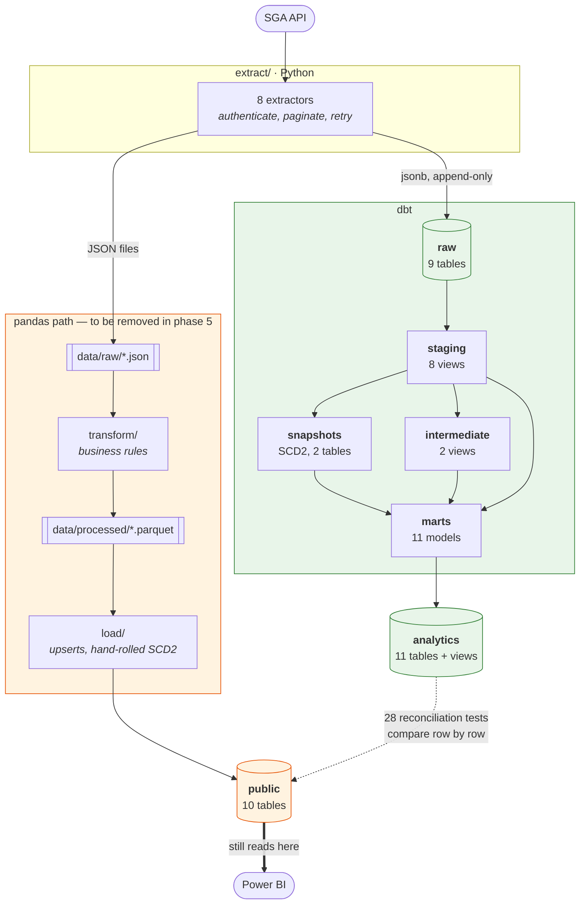
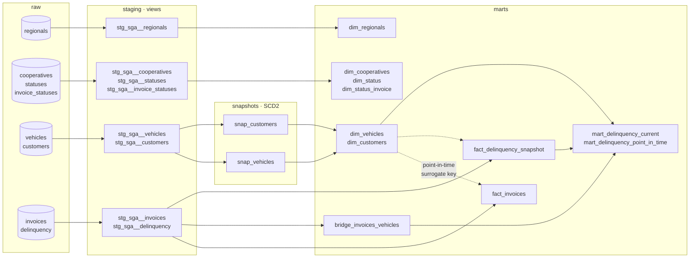
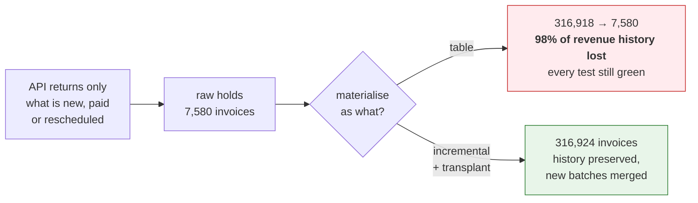
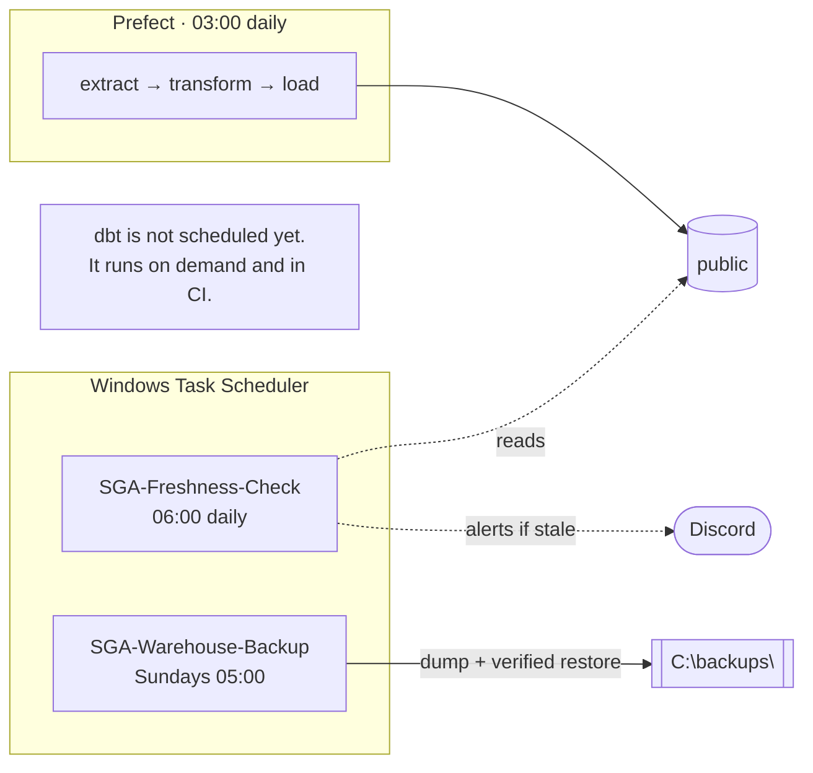
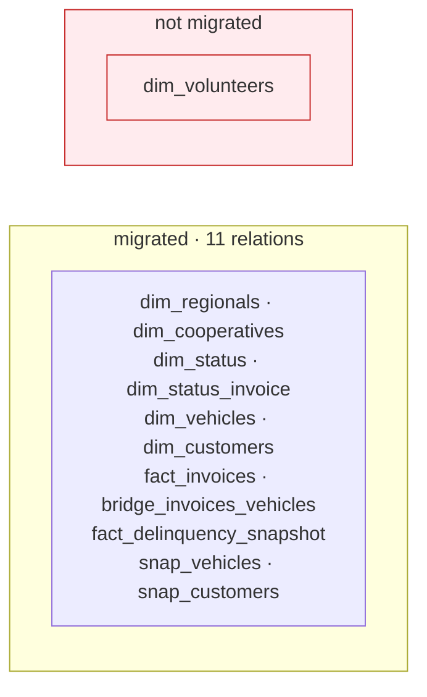
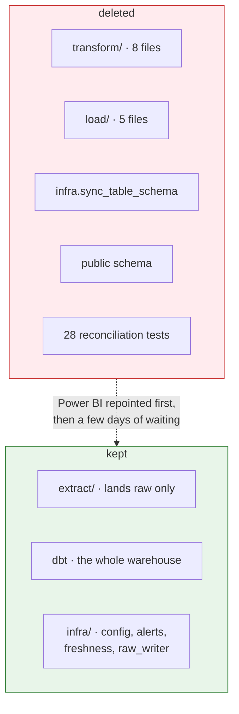

# Current architecture

A snapshot of the pipeline as it stands **mid-migration**, on 2026-08-26. Two
paths run in parallel over the same warehouse: the original pandas path, which
still serves Power BI, and the dbt path, which reproduces it from a raw layer.
Neither is removed until the other is proven — see [`ROADMAP.md`](../ROADMAP.md).

---

## 1. The whole picture

**What to read out of it.** Extraction writes to two places. The file feeds the
path that still serves the business; the jsonb feeds the path that will replace
it. Everything downstream is duplicated on purpose, and 28 singular tests hold
the two sides to the same answer on every build.

---

## 2. Inside dbt

Three materialisation choices, each for a reason:

| Layer | Materialised as | Why |
|---|---|---|
| `staging` | view | Cheap to rebuild, always reads the latest batch |
| `dim_*` | table | Consumed by Power BI; a view would re-run the chain per visual |
| `snap_*` | snapshot | dbt manages `dbt_valid_from` / `dbt_valid_to` in one MERGE |
| `fact_*`, `bridge_*` | **incremental** | They *accumulate* — see below |

---

## 3. Why the facts are incremental

The single most consequential thing to understand about this pipeline.

The same applies to `bridge_invoices_vehicles` (382,761 rows), to
`fact_delinquency_snapshot` (39 daily photographs) and to the SCD2 history
(33,939 versions). None can be rebuilt from the source: the API answers about
the present, and yesterday's answer is gone unless it was stored.

That history was seeded once by the migrations under
[`sql/migrations/`](../sql/migrations/), and it is why `--full-refresh` and
`dbt build --empty` must never touch the real warehouse.

---

## 4. What runs on a schedule

Two things run **outside** the orchestrator on purpose. `infra/freshness.py` is
the dead-man's switch: it detects that the pipeline did not run at all, which no
alert inside the pipeline can do. `scripts/backup_warehouse.py` follows the same
logic — a backup that runs only when the pipeline runs fails exactly when it is
needed.

`dbt` is deliberately absent from this diagram: it has no schedule. Every PR
builds all 97 nodes against a throwaway PostgreSQL container in CI, but nothing
runs it daily against production. That is [issue #9](../../issues/9).

---

## 5. Known gap

`dim_volunteers` exists **only in `public`**. It was in the scope of phase 2 and
was never built in dbt — the phase was recorded as complete with three of its
four dimensions done. It is the one table that would be lost by deleting
`load/`, so it has to be migrated before the cutover can proceed.

---

## 6. What phase 5 removes

The reconciliation tests go too, and that is the uncomfortable part: they exist
to compare against `public`, so they become meaningless the moment `public` does.
Everything they were protecting has to be protected by something else first —
which is why the backup was built before the cutover, not after.
