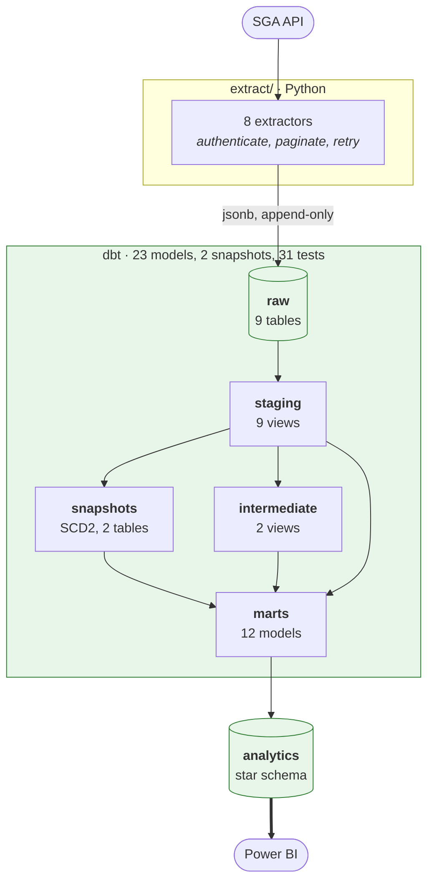
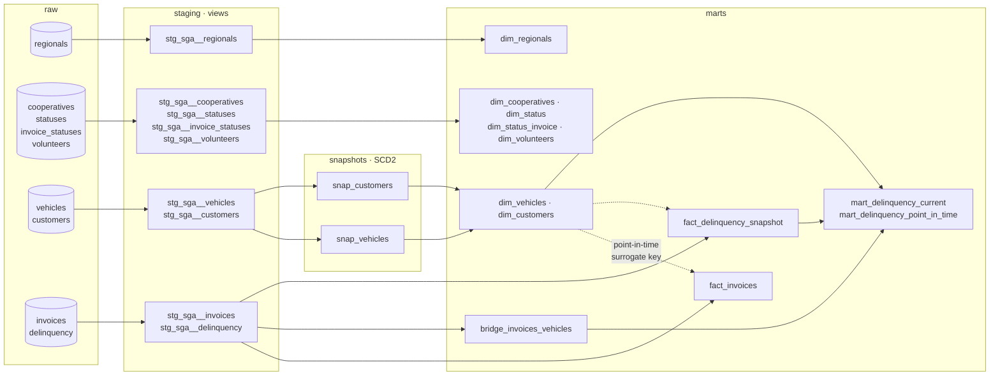
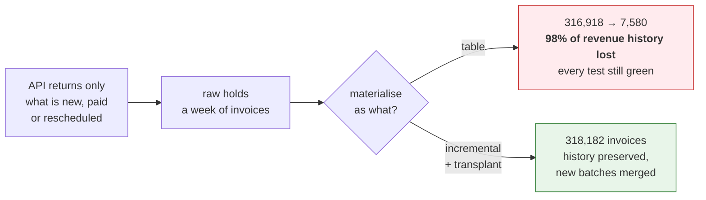
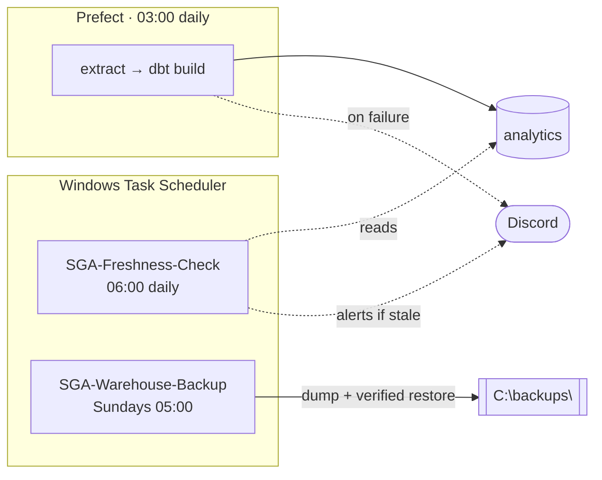
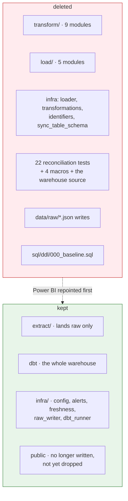

# Current architecture

The pipeline as it stands **after the cutover**, on 2026-08-29. There is one
path: Python extracts, dbt does everything else. The pandas path that ran
alongside it for eleven days was deleted once the two agreed row by row — see
[`ROADMAP.md`](../ROADMAP.md).

---

## 1. The whole picture

**What to read out of it.** Python has exactly one job, and it is the one job
that cannot be done in SQL: talking to something outside this machine.
Everything downstream is versioned SQL, tested on every run, rebuildable from
what the API actually returned.

---

## 2. Inside dbt

Four materialisation choices, each for a reason:

| Layer | Materialised as | Why |
|---|---|---|
| `staging` | view | Cheap to rebuild, always reads the latest batch |
| `snap_*` | snapshot | dbt manages `dbt_valid_from` / `dbt_valid_to` in one MERGE |
| `dim_vehicles`, `dim_customers` | table | Rebuilt in full from the snapshots every run |
| everything else in `marts` | **incremental** | They *accumulate* — see below |

---

## 3. Why the facts are incremental

The single most consequential thing to understand about this pipeline.

The same applies to `bridge_invoices_vehicles` (384,242 rows), to
`fact_delinquency_snapshot` (43 daily photographs) and to the SCD2 history
(34,652 versions). None can be rebuilt from the source: the API answers about
the present, and yesterday's answer is gone unless it was stored.

That history was seeded once by the migrations under
[`sql/migrations/`](../sql/migrations/), and it is why `--full-refresh` and
`dbt build --empty` must never touch the real warehouse.

---

## 4. What runs on a schedule

dbt runs **inside** the flow, not beside it. While it ran on demand, three days
of drift collapsed fifty-nine SCD2 transitions into a single date; a warehouse
written last night compared against one written last week measures the
schedule, not the models. A failing dbt node — a test included — stops the run.

Two things run **outside** the orchestrator, also on purpose.
`infra/freshness.py` is the dead-man's switch: it detects that the pipeline did
not run at all, which no alert inside the pipeline can do.
`scripts/backup_warehouse.py` follows the same logic — a backup that runs only
when the pipeline runs fails exactly when it is needed.

---

## 5. What the cutover removed

The reconciliation tests went too, and that is the uncomfortable part: they
existed to compare against `public`, so they became meaningless the moment
`public` did. What replaced them is not another comparison but the seven
singular tests and the schema tests that run against real rows every night —
and, before any of it, a backup that is restored and counted rather than merely
written.

`public` is still there, holding the last state the pandas path wrote. Nothing
reads it and nothing writes it. Dropping it is a decision for a calmer day.
